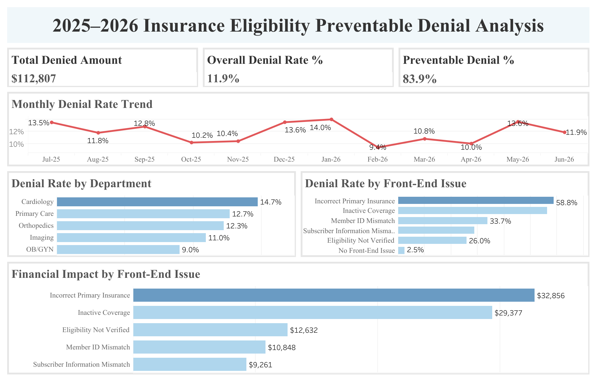
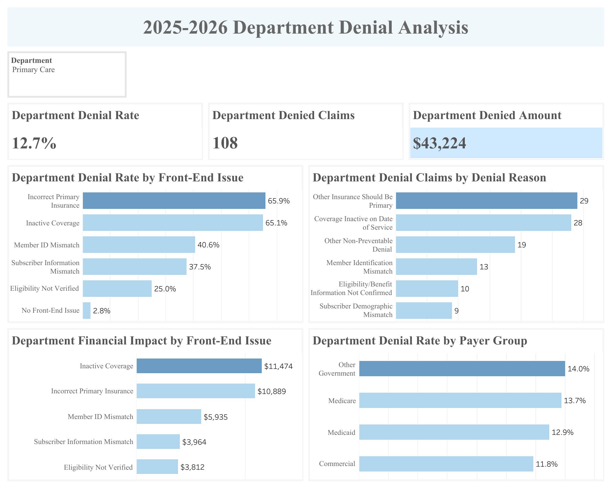
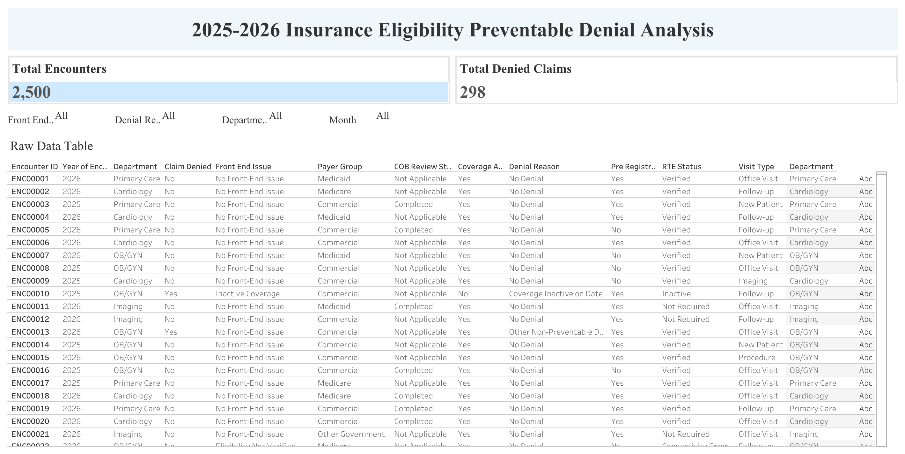
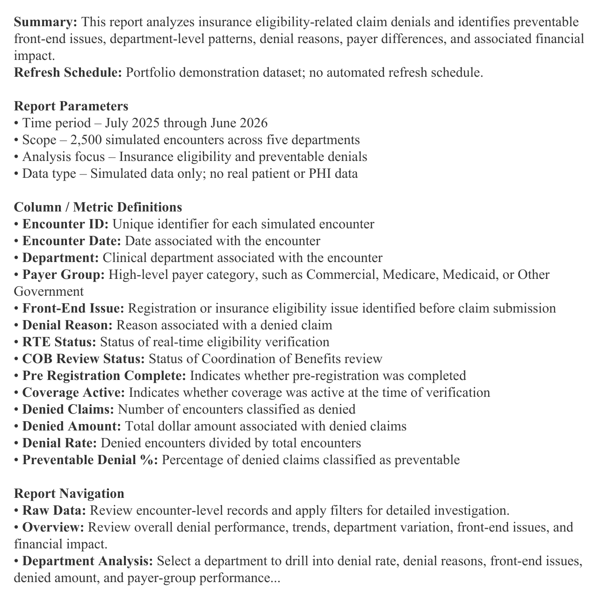

# 🏥 Healthcare Claim Denial Analysis

## Project Overview

This is an end-to-end healthcare business analytics project that investigates outpatient claim denials and identifies operational opportunities to reduce preventable revenue loss.

The project combines Python-based data auditing, data cleaning, exploratory data analysis (EDA), business analytics, and Tableau visualization to transform simulated healthcare operational data into actionable business insights.

The analysis focuses specifically on insurance eligibility and front-end registration issues, with additional drill-down analysis by department, payer group, denial reason, and financial impact.

The final deliverable includes an interactive Tableau dashboard designed to support operational monitoring and denial-reduction decision-making.

---

## Business Problem

Claim denials are a major challenge in healthcare revenue cycle management. They delay reimbursement, increase administrative rework, and negatively affect financial performance.

Many denials can originate before a claim is submitted. Front-end issues such as incorrect primary insurance selection, inactive coverage, incomplete eligibility verification, member identification errors, and subscriber information mismatches may result in claims that require correction or rework.

The central business question for this project is:

> **Which front-end insurance and registration issues create the greatest denial exposure, where are those issues concentrated, and which operational interventions should be prioritized?**

Rather than evaluating denial rate alone, the analysis considers denial frequency, department-level variation, payer differences, and financial exposure to identify the highest-impact improvement opportunities.

---

## Project Objectives

The objectives of this project are to:

- Audit and clean simulated healthcare operational data.
- Measure overall claim denial performance.
- Identify the most common preventable front-end denial drivers.
- Evaluate denial patterns across clinical departments.
- Examine payer-specific denial differences.
- Quantify the financial impact of different front-end issues.
- Distinguish high-rate problems from high-volume problems.
- Translate analytical findings into targeted operational recommendations.
- Develop an interactive Tableau dashboard for denial monitoring and investigation.

---

## Dataset

This project uses a simulated outpatient healthcare dataset containing **2,500 patient encounters** from **July 2025 through June 2026** across five clinical departments:

- Cardiology
- Primary Care
- Orthopedics
- Imaging
- OB/GYN

The dataset contains operational fields including:

- Encounter ID and encounter date
- Clinical department
- Visit type
- Insurance payer group
- Front-end registration issue
- Real-time eligibility (RTE) status
- Coordination of Benefits (COB) review status
- Pre-registration completion
- Coverage status
- Claim denial status
- Denial reason
- Denied amount

All data used in this project is simulated for portfolio demonstration purposes. No real patient information or protected health information (PHI) is included.

---

## Project Workflow

```text
Business Problem
      ↓
Data Audit
      ↓
Data Cleaning
      ↓
Exploratory Data Analysis
      ↓
Denial Driver Analysis
      ↓
Department & Payer Drill-Down
      ↓
Financial Impact Analysis
      ↓
Business Insights
      ↓
Operational Recommendations
      ↓
Tableau Dashboard
```

---

# Key Findings

## 1. Preventable front-end issues account for the majority of denial exposure

Of 2,500 encounters, **298 claims were denied**, resulting in an overall denial rate of approximately **11.9%** and **$112,807 in denied charges**.

Approximately **83.9% of denied claims** were associated with preventable front-end issues.

More importantly, denial exposure was highly concentrated. The two leading front-end issues were:

- **Incorrect Primary Insurance:** 87 denials
- **Inactive Coverage:** 80 denials

Together, these two issues accounted for:

- **167 of 298 denied claims (56.0%)**
- approximately **$62,233 in denied charges (55.2% of total denied dollars)**

This concentration indicates that a relatively small number of registration and insurance-verification workflows represent the largest measurable opportunity for denial reduction.

---

## 2. Department risk is driven by both denial rate and encounter volume

Department performance varied substantially.

| Department | Denial Rate |
|---|---:|
| Cardiology | **14.7%** |
| Primary Care | **12.7%** |
| Orthopedics | **12.3%** |
| Imaging | **11.0%** |
| OB/GYN | **9.0%** |

Cardiology had the highest denial rate at **14.7%**, while OB/GYN had the lowest at **9.0%**.

However, denial rate alone does not identify the largest operational opportunity.

Primary Care generated **108 denied claims**, the highest absolute denial volume in the dataset, because it also handled the largest encounter volume.

Within Primary Care:

- Incorrect Primary Insurance generated 29 denials.
- Inactive Coverage generated 28 denials.
- Together they accounted for **57 of 108 Primary Care denials (52.8%)**.
- These two issues represented approximately **$22,363 in denied charges**.

This distinction is operationally important: the department with the highest denial rate is not necessarily the department with the greatest opportunity to reduce the total number of denied claims.

---

## 3. Department-level analysis reveals distinct operational failure patterns

Front-end denial drivers were not distributed uniformly across departments.

In **Cardiology**, Incorrect Primary Insurance and Inactive Coverage generated 17 denials each. Together, they accounted for **34 of 60 Cardiology denials (56.7%)**.

In **Orthopedics**, Inactive Coverage generated 16 denials and Incorrect Primary Insurance generated 13. Together, these two issues accounted for **29 of 44 denials (65.9%)**.

**Imaging** showed a particularly concentrated pattern. Incorrect Primary Insurance alone generated **16 of 38 Imaging denials (42.1%)** and approximately **$8,053 in denied charges**, making it the department's dominant front-end financial issue.

These differences suggest that a single organization-wide denial strategy may overlook department-specific failure patterns. Targeted interventions may therefore be more actionable than uniform training across all front-end issues.

---

## 4. OB/GYN provides a useful internal benchmark for further workflow investigation

OB/GYN had the lowest overall denial rate at **9.0%**.

It also showed a different denial mix from several higher-denial departments. Approximately **27.1% of OB/GYN denials** were classified as having no identifiable front-end issue / other non-preventable denial.

Because this is a simulated observational dataset, the analysis cannot establish that a particular OB/GYN workflow caused its lower denial rate.

However, the performance difference makes OB/GYN a useful internal benchmark for further comparison of:

- pre-registration practices,
- insurance verification timing,
- primary/secondary insurance review,
- and exception-handling workflows.

Understanding which operational practices differ between lower- and higher-denial departments could help identify processes worth standardizing.

---

## 5. Payer risk varies by department rather than following one organization-wide pattern

At the overall level, Medicaid had the highest payer denial rate at approximately **13.2%**.

However, department-level analysis revealed that payer risk was not consistent across the organization.

For example:

- **Cardiology:** Medicaid denial rate reached **20.2%**
- **Orthopedics:** Commercial insurance had the highest denial rate at **14.8%**
- **Imaging:** Other Government plans had the highest observed denial rate at **12.5%**

This suggests that payer-related denial risk should not be interpreted solely at the organization-wide level.

Instead, payer performance should be investigated within individual department workflows, where differences in registration processes, eligibility verification, and payer requirements may create distinct operational risks.

---

# Business Recommendations

## 1. Prioritize primary-insurance and active-coverage verification

Incorrect Primary Insurance and Inactive Coverage together account for **56.0% of all denied claims** and approximately **55.2% of total denied dollars**.

Rather than distributing improvement efforts evenly across all denial categories, the first operational intervention should focus on these two workflows.

Potential actions include:

- Confirm primary and secondary insurance order during pre-registration.
- Verify active coverage before the date of service.
- Flag inactive or unresolved coverage for follow-up before the encounter.
- Create an exception queue for eligibility issues that cannot be resolved automatically.
- Escalate unresolved insurance-order or coverage issues before claim submission.

Because more than half of denial volume and denied dollars are concentrated in these two categories, improvements here would address the largest measurable source of preventable denial exposure.

---

## 2. Use different strategies for high-rate and high-volume departments

**Cardiology** should be investigated as a high-rate department because its denial rate is the highest at **14.7%**.

More than half of Cardiology denials (**56.7%**) are concentrated in Incorrect Primary Insurance and Inactive Coverage, providing a specific starting point for workflow review.

**Primary Care**, however, represents a high-volume opportunity. Although its denial rate is lower at **12.7%**, it generates **108 denied claims**, the largest absolute denial volume in the dataset.

Therefore, operational prioritization should not rely on denial rate alone.

Department monitoring should evaluate both:

> **Denial Rate × Denial Volume × Financial Exposure**

This approach better identifies where process improvement could produce the greatest operational impact.

---

## 3. Target Imaging specifically for primary-insurance selection errors

Incorrect Primary Insurance accounts for **42.1% of Imaging denials** and approximately **$8,053 in denied charges**.

This concentration suggests that broad front-end training may be less useful than a targeted review of how primary insurance is identified during Imaging scheduling and registration.

A focused workflow review could examine:

- whether insurance order is confirmed when imaging is scheduled,
- whether existing coverage records are being reused without revalidation,
- and how staff handle multiple active insurance plans.

The objective would be to address the department's dominant denial driver rather than applying the same intervention to every front-end issue.

---

## 4. Investigate the Cardiology–Medicaid segment as a targeted high-risk population

Cardiology has the highest overall department denial rate, while Medicaid claims within Cardiology show a **20.2% denial rate**, substantially above Cardiology's overall **14.7%** rate.

A focused review should examine whether the elevated denial rate is associated with:

- eligibility verification,
- coverage changes,
- Coordination of Benefits,
- insurance sequencing,
- or payer-specific registration requirements.

The available dataset identifies the segment as high risk but does not establish which workflow causes the difference; additional operational review would therefore be required before implementing a payer-specific intervention.

---

## 5. Build denial monitoring around both frequency and financial exposure

Operational dashboards should monitor multiple denial measures rather than ranking issues solely by claim count.

Recommended monitoring metrics include:

- Overall denial rate
- Denial count
- Preventable denial percentage
- Total denied amount
- Average denied amount per claim
- Denial rate by department
- Denial rate by payer group
- Front-end issue distribution

For example, Subscriber Demographic Mismatch occurs relatively infrequently but has the highest average denied amount at approximately **$441 per claim**.

Combining frequency and financial severity helps prevent lower-volume but financially meaningful problems from being overlooked.

---

# Tableau Dashboard

The Tableau workbook was designed to support both executive-level monitoring and detailed operational investigation.

## Overview Dashboard

The Overview dashboard summarizes:

- Total denied amount
- Overall denial rate
- Preventable denial percentage
- Monthly denial-rate trend
- Denial rate by department
- Denial rate by front-end issue
- Financial impact by front-end issue



---

## Department Analysis

The Department Analysis dashboard allows users to select a clinical department and investigate:

- Department denial rate
- Total denied claims
- Total denied amount
- Denial rate by front-end issue
- Denied claims by denial reason
- Financial impact by front-end issue
- Denial rate by payer group

This drill-down view helps distinguish organization-wide patterns from department-specific operational risks.



---

## Raw Data Investigation

The Raw Data dashboard provides encounter-level records and interactive filters for:

- Front-end issue
- Denial reason
- Department
- Month

This allows analysts or operational users to move from aggregated dashboard findings to the underlying encounter records for further investigation.



---

## Data Dictionary / Glossary

The Tableau workbook also includes a glossary describing report parameters, field definitions, metrics, and report navigation.



---

# Repository Structure

```text
healthcare-claim-denial-analysis/
│
├── data/
│   ├── raw_encounters.csv
│   └── cleaned_encounters.csv
│
├── notebooks/
│   ├── 01_Data_Audit_Cleaning.ipynb
│   └── 02_EDA.ipynb
│
├── images/
│   ├── Overview.png
│   ├── Department Analysis.png
│   ├── Rawdata.png
│   └── Glossary.png
│
├── tableau/
│   └── insurance_eligibility_denial_analysis.twbx
│
└── README.md
```

---

# Tools Used

- **Python** — data preparation and analysis
- **Pandas** — data cleaning, transformation, and aggregation
- **NumPy** — numerical operations
- **Matplotlib** — exploratory visualization
- **Jupyter Notebook** — data audit, cleaning, and EDA documentation
- **Tableau** — interactive business intelligence dashboard
- **GitHub** — project documentation and version control

---

## Limitations

This project uses simulated data designed for portfolio demonstration and does not represent the performance of any real healthcare organization.

The analysis identifies associations and operational patterns within the simulated dataset but does not establish causal relationships between specific workflows and claim denials.

Recommendations should therefore be interpreted as areas for operational investigation and process improvement rather than confirmed causal interventions.

---

## Conclusion

The analysis shows that denial exposure is not evenly distributed across front-end issues, departments, or payer groups.

More than half of all denied claims and denied dollars are concentrated in just two front-end issues: **Incorrect Primary Insurance and Inactive Coverage**.

At the same time, department-level analysis demonstrates that operational priorities differ depending on whether the objective is to reduce denial rate, denial volume, or financial exposure.

The findings support a targeted denial-management strategy that combines organization-wide prioritization of major front-end issues with department- and payer-specific workflow investigation.
